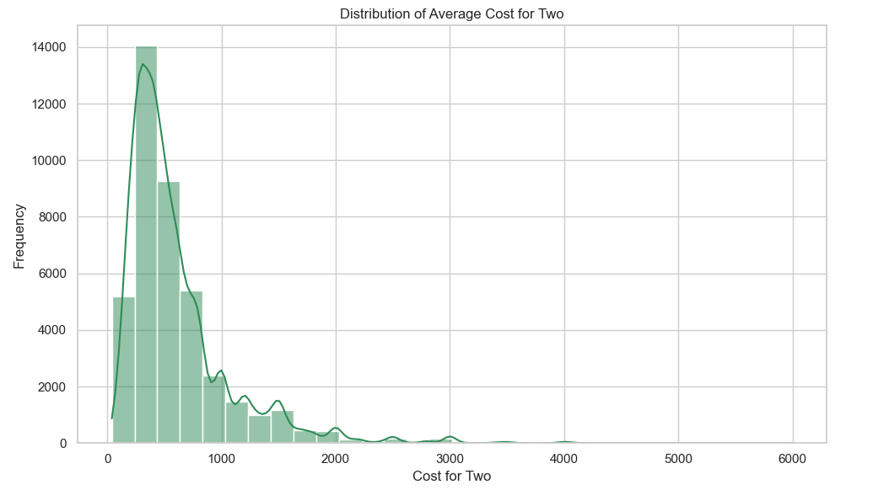

# Zomato Food Delivery Data Analysis

This project performs **Exploratory Data Analysis (EDA)** on real-world **Zomato restaurant dataset**. The goal is to uncover actionable insights about restaurant distribution, cost, ratings, and cuisine trends across various cities in India. The project uses Python, Pandas, Matplotlib, and Seaborn for data processing and visualization. And project follows cuisine trends to support strategic business decisions for food delivery services.

---

## 📂 Project Files

- `Zomato_EDA.ipynb` - EDA notebook
- `.png` files - Data visualization outputs
- ` README.md` 
---

## 📈 Key Visualizations

### 🏙️ Top 10 Cities by Number of Restaurants  
Highlights the cities with the most listed restaurants.  

---

### 💰 Distribution of Average Cost for Two  
Visualizes how much customers typically spend.  

---

### 🌟 Distribution of Restaurant Ratings  
Shows the spread of ratings across restaurants.  

---

### ⭐ Average Rating by City (Top 10)  
Identifies which cities have the highest rated restaurants.  

---

### 💵 Average Cost for Two by City (Top 10)  
Highlights spending trends by city.  

---

### 📉 Cost vs Rating Scatter Plot  
Reveals the relationship between spending and customer satisfaction.  

---

### 🍜 Top 10 Most Common Cuisine Types  
Finds which cuisines are most prevalent.  

---

### 🔝 Top 10 Cuisines by Average Rating  
Highlights the best-rated cuisines overall.  

---

## 🤖 Tools Used

- Python
- Pandas
- NumPy
- Matplotlib
- Seaborn
- Jupyter Notebook

⚠️ Note: I used AI assistance (ChatGPT) for guidance and optimization in code, Solve KeyError bugs, Clean and Prepare the Data
---

## 📬 Dataset Source

The original dataset `zomato.csv` exceeded GitHub’s 100MB limit and is not stored in the repository.

You can download it here:

👉 [Download Zomato Dataset ( https://www.kaggle.com/datasets/himanshupoddar/zomato-bangalore-restaurants ) 

> Note: If the above link doesn't work, please contact the author or raise an issue in the repo.

---

## 🔍 Key Insights

As a **Business Analyst**, the following actionable insights are derived:

- High-density cities like Bangalore, Delhi, and Mumbai dominate the restaurant space.

- North Indian, Chinese, and Fast Food are the most frequently offered cuisines.

- Higher cost often correlates with better ratings, indicating perceived value.

- Some popular cuisines have poor average ratings, showing a gap between demand and satisfaction.

💡 Recommendations:

- Focus marketing and partnerships in cities with high restaurant density and high user ratings (e.g., Delhi, Bangalore).

- Encourage low-performing cities or cuisines to improve service standards via quality assurance programs.

- Introduce tiered delivery models (e.g., basic vs. premium).

- Promote highly rated cuisines (e.g., Mexican, Continental) that may not be as commonly offered.

- Use pricing strategies based on cost trends — such as highlighting value meals in premium cities.

--- 

## 👨‍💻 Author

**Sahil Gore**  
GitHub: [@SahilGore-bit](https://github.com/SahilGore-bit)
